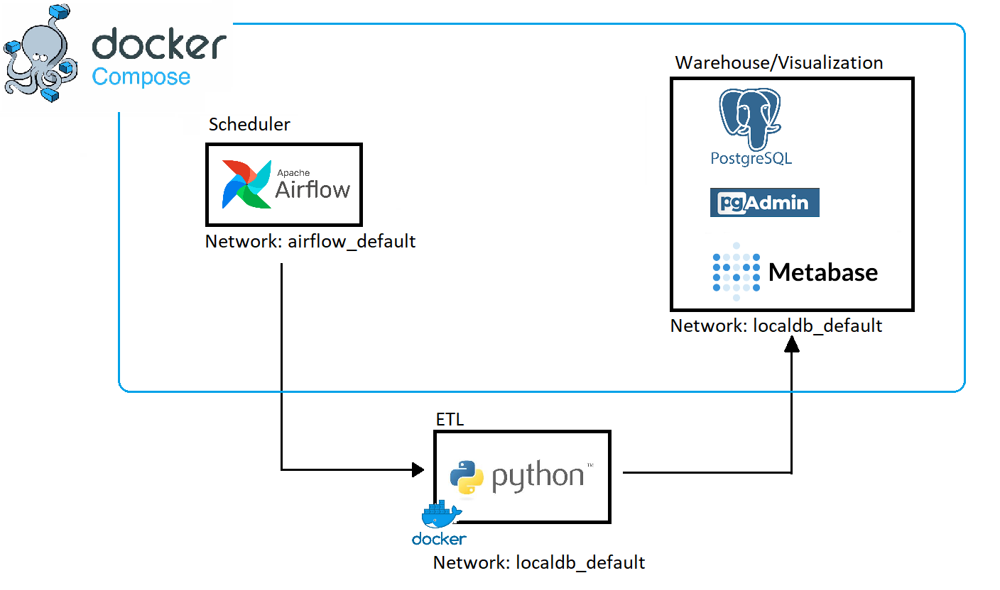

# Data Engineering simple weather ETL pipeline with dashboard

## Overview

Using [Open-Meteo Weather API](https://open-meteo.com/) to get USA states weather data.
Storing it inside local Postgresql data base which acts as a data warehouse and visualizing it with Metabase.
The Airflow and local database are set up separately with docker compose files.
The ETL is run using DockerOperator (running as docker container) and is not run inside airflow dag script to seperate execution of ETL from scheduling code,
as it is a good practice to separate tasks and scheduling code. Also this way is easier to scale and maintain.

## Reproducibility

The username and password for Airflow is the default "airflow" and for other services the username/password/mail are in *localDB/.env* file. 

### localDB
Contains docker-compose file to setup on same network Postgresql, pgAdmin and Metabase containers. The Postgresqll is used as local warehouse to store all data from the ETL.

Create *db-data* folder as this is the folder that is used inside the docker-compose file as the volume to persistently store data.

### airflow
Basic quick start set up from [here](https://airflow.apache.org/docs/apache-airflow/stable/howto/docker-compose/index.html)  (the docker-compose file has some services removed to make it more lightweight from the standard one from the url). 
 The DAG file is inside *dags* folder which also contains *tasks* folder with the ETL python code to get weather and states location data. The docker file to create docker image also there.

**NOTE:** Build the ETL python docker image before running the dags in airflow. In tasks directory run:

`docker build -t etl:script .`

Its important because DockerOperator will try to use this image to create docker container to run the ETL code.

When inside Airflow it will look something like:

Except all dags will be paused. You need to unpause the "Getting_places_data" dag first because other two depend on data that it gets into local database from *localDB*.

## **NOTE:** This project uses some quick start option which is not suitable for production environment. It was mainly build to learn and get used to new tools and concepts like: Docker, Airflow, Metabase and Data Engineering overall.
